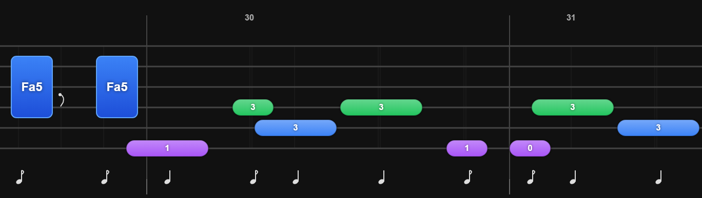

Me gustaría que alinearas estrictamente las notas y los acordes. Es decir, todo debe ir junto a excepción de cuando haya silencios intercalados. Y no debe haber ni separaciones, ni notas (trastes) solapadas entre ellas, porque quizas haya una semicorchea con una negra y cosas del estilo. Revisa bien esos casos.

Te adjunto una foto para que entiendas mejor el problema:

